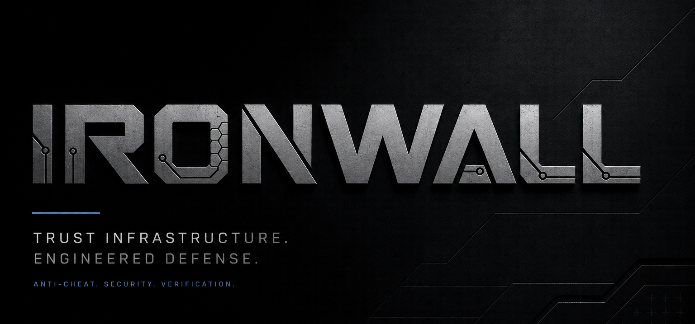

<p align="center">
  
</p>

<h3 align="center">Open-source anti-cheat protocol with cryptographically verifiable enforcement.</h3>

<p align="center">
  <a href="https://github.com/wflores9/Ironwall/actions/workflows/ci.yml"></a>
  <a href="LICENSE"></a>
  
  
</p>

---

## Why Ironwall

Every major anti-cheat is a black box. Players get banned with no evidence, studios get review-bombed over false positives, and nobody can independently verify a single enforcement decision.

Ironwall inverts that. **Every detection, attestation, and ban produces a cryptographic audit trail** — Merkle-committed inputs, TEE attestation receipts, and immutable on-chain match records. When Ironwall bans a player, the studio can prove *what* was detected, *when*, and *why*. Publicly, if they choose.

Detection is table stakes. **Verifiable enforcement is the product.**

## Architecture

```
[PLAYER DEVICE]  →  [LAYER 2: Module Signing / TEE]  →  [LAYER 3: Remote Attestation]
      ↓                                                           ↓
[LAYER 1: Game Server]  →  [LAYER 4: On-Chain Record]  →  [VERIFIED MATCH RECORD]
```

Four layers form a sequential trust chain. A compromised or missing component at any layer results in **hard session denial** — never degraded security.

| Layer | Component | Responsibility |
|-------|-----------|----------------|
| 1 | ThinClient / GameServer | Input capture, server-side simulation (optional thin-client mode) |
| 2 | ModuleSigner / TEEVerifier | ECDSA P-256 build-time signing, SGX/SEV runtime verification |
| 3 | RemoteAttestationBroker | 60-second re-attest loop, Ed25519 session token gating |
| 4 | XRPL / Hedera Recorders | Immutable on-chain match records, identity, reputation |
| ZK | ZKProver / HumanConstraints | PLONK proof of physical human input constraints |
| Audit | InputMerkleTree | Per-input HMAC leaves, auditable Merkle root anchored on-chain |

Dual-chain by design: **XRPL** and **Hedera HCS** recorders ship today; the recorder interface is chain-agnostic.

## Quick Start

### Prerequisites

- Python 3.11+ (3.12 recommended)
- Rust 1.75+ (launcher + perf-critical paths)
- Node.js 20+ (ZK circuit tooling)
- Docker 24+ (integration test harness, SGX emulation)

### Install

```bash
git clone https://github.com/wflores9/Ironwall.git
cd Ironwall

# Python deps
python -m venv .venv && source .venv/bin/activate
pip install -e '.[dev]'

# Node deps (ZK tooling)
npm install

# Compile ZK circuits (~2 min first run)
make circuits
```

### Configure

```bash
cp .env.example .env
# fill in HEDERA_OPERATOR_ID, HEDERA_OPERATOR_KEY, IRONWALL_TOPIC_ID
```

> **SGX_MODE=SIM** uses Intel's software simulation — no SGX hardware required for development.
> Switch to `SGX_MODE=HW` on a compatible machine (11th-gen+ Intel) before production use.

### Run Tests

```bash
make test-unit          # fast, no external deps — 65 tests
make test-integration   # requires docker-compose up -d
make test-zk            # ZK circuit tests (~5 min)
make cov                # coverage report
```

### Verify Match Records

```bash
ironwall-verify record.json
ironwall-verify record.json --json
make verify-demo
```

The verifier accepts full Hedera match records, Hedera stub receipts, and XRPL
fingerprints. It validates the match id, SHA3-256 Merkle root, attested TEE
receipt, and compact receipt hash fields used for public audit trails.

`make verify-demo` runs the verifier against `examples/match-record-valid.json`
and then confirms that `examples/match-record-tampered.json` is rejected.

## Repository Structure

```
ironwall/
├── core/                   # Shared crypto, logging, chain clients
├── layer1_thinclient/      # Thin client + game server simulation
├── layer2_signing/         # ECDSA module signing + TEE verifier
├── layer3_attest/          # Remote attestation broker + session mgmt
├── layer4_hedera/          # HCS match recorder, identity, wagering
├── layer4_xrpl/            # XRPL recorder, identity, escrow, ZK hooks
├── zk_anticheat/           # ZK-SNARK circuit + proof generation
│   └── circuits/           # circom circuit definitions
├── merkle_audit/           # Input Merkle tree + audit trail
ironwall_launcher/          # Rust launcher: manifest verify + module scan
samples/                    # Unity / Unreal integration examples
tests/
├── unit/                   # Fast, no external deps
└── integration/            # Docker-based full-stack tests
```

## Security Model

- **Trust boundary**: everything client-side is adversarial. The game server and on-chain layer are the only trusted components.
- **extract_pov()** is the fog-of-war boundary. It must never include entity positions outside the player's visibility cone.
- **SHA3-256 only** in all crypto paths — never SHA-256 (length-extension attack risk).
- **Pinned MRENCLAVE**: set `IRONWALL_EXPECTED_MRENCLAVE` or `IRONWALL_MRENCLAVE_FILE` from a reproducible-build artifact before running `SGX_MODE=HW`.
- **Hypervisor defeat**: Intel SGX TCB measurement flags virtualisation. Ring-1 cheats fail `_tcb_fresh()` + `_no_debug_flag()` → hard session denial.
- **Hard deny, never degrade**: missing attestation, stale token, or CT log mismatch all terminate the session. There is no "reduced trust" mode.

## Roadmap

- [ ] Production Intel IAS / AMD KDS quote verification (replacing SIM stubs)
- [x] Pinned MRENCLAVE verification from reproducible builds
- [ ] PLONK verifier contract (Hedera EVM + XRPL Hooks)
- [x] Unreal / Unity sample game integration
- [x] Public match-record verification CLI (`ironwall-verify record.json`)
- [x] Controller input normalisation (Xbox / PS5 / Switch)

## Contributing

See [CONTRIBUTING.md](CONTRIBUTING.md) for the PR checklist and code style guide. Security-sensitive paths (`extract_pov`, `TEEVerifier`, attestation) receive heightened review.

### Security Disclosure

Do **not** open a public GitHub issue for security vulnerabilities. Use [GitHub private vulnerability reporting](https://github.com/wflores9/Ironwall/security/advisories/new) — 24-hour acknowledgement, 14-day patch target.

## License

MIT — see [LICENSE](LICENSE).

---

<p align="center"><em>Built for competitive integrity. Engineered for scale.</em></p>
